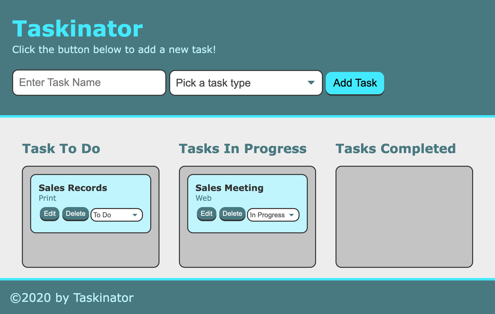

# Taskinator

## Description 
Taskinator is an "task-tracker" app. The app allows a user to create and save task. Once the task is created, the user is able to organize the task into the "In Progress" or "Task Completed" colum to keep track to each task. The wep app is built using HTML, CSS. JavaScript, and Web Storage API. 

## Screenshot 

## Deployment

[Link](https://mariamv29.github.io/taskinator/)

---

🏆 
## Badges

## Contributing / Credits

[mariamv29](https://github.com/mariamv29/README-generator.git)